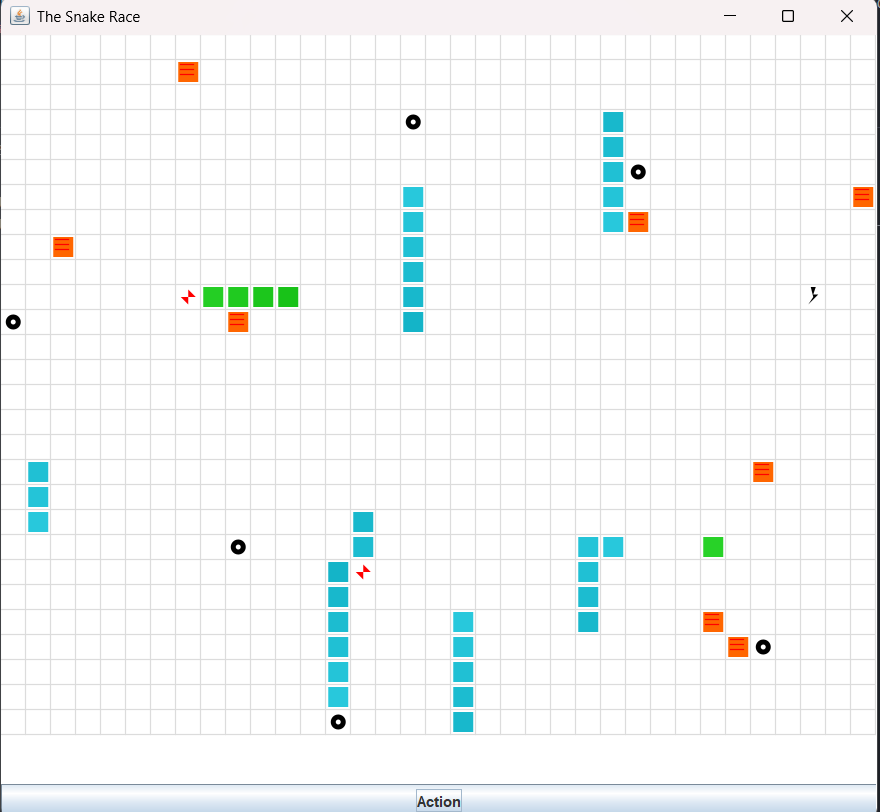
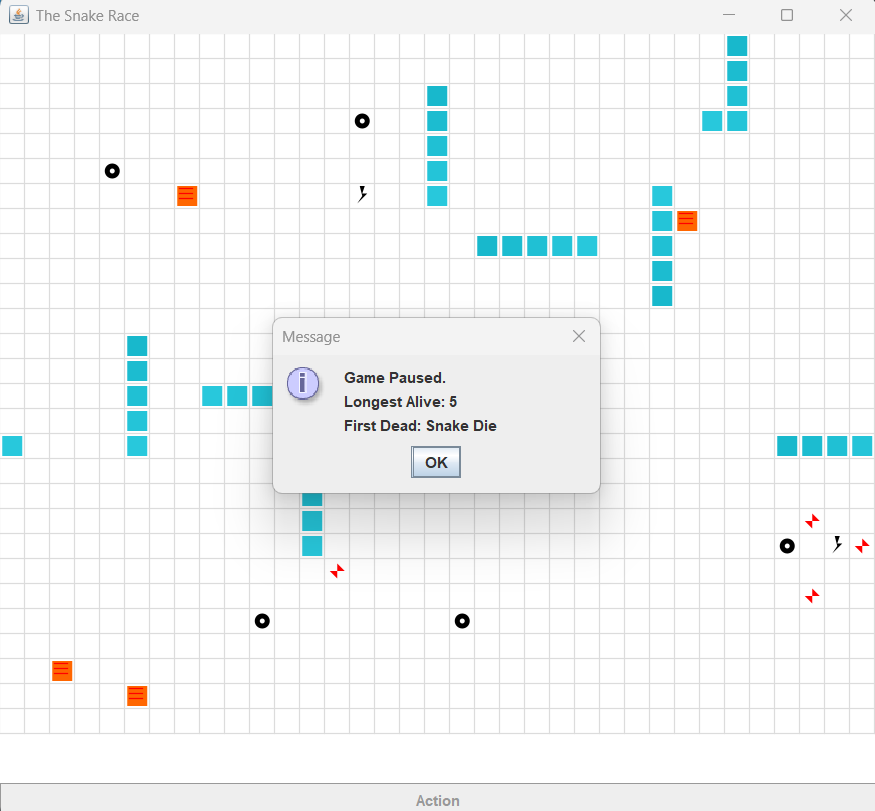
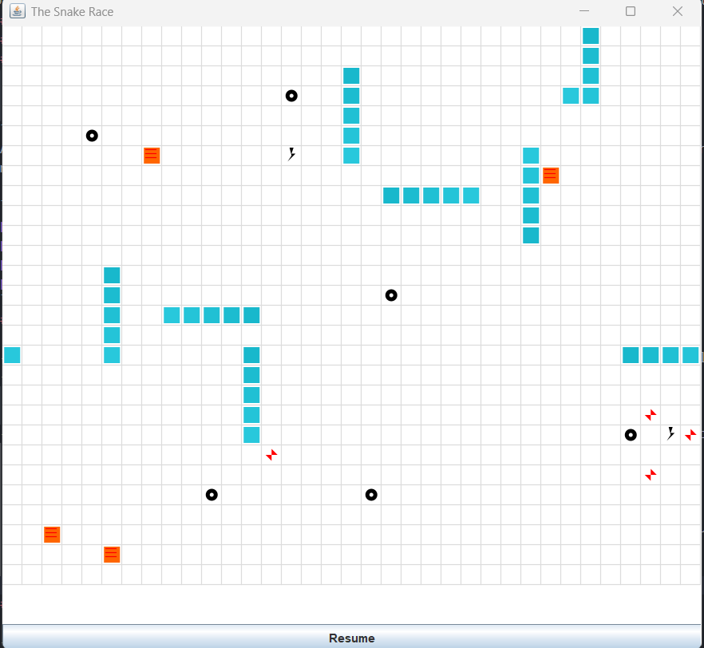
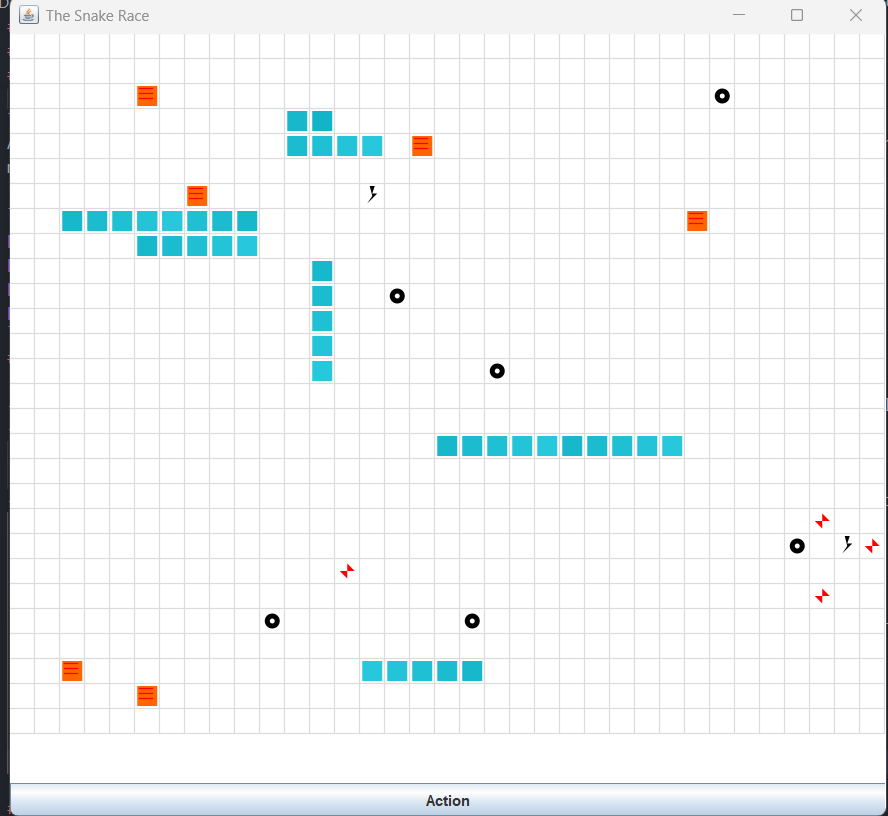

# Snake Race — ARSW Lab #2 (Java 21, Virtual Threads)

**Escuela Colombiana de Ingeniería – Arquitecturas de Software**  
Laboratorio de programación concurrente: condiciones de carrera, sincronización y colecciones seguras.

---

## Requisitos

- **JDK 21** (Temurin recomendado)
- **Maven 3.9+**
- SO: Windows, macOS o Linux

---
### Instalación

---

1. Clone this repository on your local machine:
   ```bash
    git clone <URL_DEL_REPOSITORIO>
    ```
2. Navigate to the project directory
    ```bash
    cd <NOMBRE_DEL_PROYECTO>
    ```

## Cómo ejecutar

Para PrimePathFinder
```bash
cd PrimePathFinder
mvn clean verify
mvn exec:java
```

Para SnakeRace
```bash
cd SnakeRace
cd SnakeRace
mvn clean verify
mvn -q -DskipTests exec:java -Dsnakes=4
```

- `-Dsnakes=N` → inicia el juego con **N** serpientes (por defecto 2).
- **Controles**:
  - **Flechas**: serpiente **0** (Jugador 1).
  - **WASD**: serpiente **1** (si existe).
  - **Espacio** o botón **Action**: Pausar / Reanudar.

---

## Reglas del juego (resumen)

- **N serpientes** corren de forma autónoma (cada una en su propio hilo).
- **Ratones**: al comer uno, la serpiente **crece** y aparece un **nuevo obstáculo**.
- **Obstáculos**: si la cabeza entra en un obstáculo hay **rebote**.
- **Teletransportadores** (flechas rojas): entrar por uno te **saca por su par**.
- **Rayos (Turbo)**: al pisarlos, la serpiente obtiene **velocidad aumentada** temporal.
- Movimiento con **wrap-around** (el tablero “se repite” en los bordes).

---

## Arquitectura (carpetas)

```
co.eci.snake
├─ app/                 # Bootstrap de la aplicación (Main)
├─ core/                # Dominio: Board, Snake, Direction, Position
├─ core/engine/         # GameClock (ticks, Pausa/Reanudar)
├─ concurrency/         # SnakeRunner (lógica por serpiente con virtual threads)
└─ ui/legacy/           # UI estilo legado (Swing) con grilla y botón Action
```

---

# Actividades del laboratorio

## Parte I — (Calentamiento) `wait/notify` en un programa multi-hilo

1. Toma el programa [**PrimeFinder**](https://github.com/ARSW-ECI/wait-notify-excercise).
2. Modifícalo para que **cada _t_ milisegundos**:
   - Se **pausen** todos los hilos trabajadores.
   - Se **muestre** cuántos números primos se han encontrado.
   - El programa **espere ENTER** para **reanudar**.
3. La sincronización debe usar **`synchronized`**, **`wait()`**, **`notify()` / `notifyAll()`** sobre el **mismo monitor** (sin _busy-waiting_).
4. Entrega en el reporte de laboratorio **las observaciones y/o comentarios** explicando tu diseño de sincronización (qué lock, qué condición, cómo evitas _lost wakeups_).

En el siguiente directorio se puede encontrar la solucion a la primera parte de (Calentamiento) `wait/notify` ⌚

[Solucion PrimePathFinder ](PrimePathFinder/src/main/java/edu/eci/arsw/primefinder/)

```java
@Override
	public void run(){
        try {
            for (int i= a;i < b;i++){	
                checkPaused();					
                if (isPrime(i)){
                    primes.add(i);
                    System.out.println(i);
                }
            }
        }catch (InterruptedException e) {
            Thread.currentThread().interrupt();
        }
	}

    //Lock para pausar el hilo
    public void pauseThread(){
        synchronized (pauseLock) {
            isPaused = true;
        }
    }
    
    //Lock para reanudar el hilo
    public void resumeThread(){
        synchronized (pauseLock) {
            isPaused = false;
            pauseLock.notifyAll();
        }
    }

    private void checkPaused() throws InterruptedException {
        synchronized (pauseLock) {
            while (isPaused) {
                pauseLock.wait();
            }
        }
    }
```

> Objetivo didáctico: practicar suspensión/continuación **sin** espera activa y consolidar el modelo de monitores en Java.

---

## Parte II — SnakeRace concurrente (núcleo del laboratorio)

En el siguiente directorio se puede encontrar la solucion a la segunda parte SnakeRace

[Solucion SnakeRace ](SnakeRace/src/main/java/co/eci/snake/)

### 1) Análisis de concurrencia

- Explica **cómo** el código usa hilos para dar autonomía a cada serpiente.

El codigo usa los hilos asignando un hilo independiente a cada `Snake`en la clase `SnakeRunner` que es donde se da la concurrencia cada instancia de esta decide si cambia de direccion, ajusta su velocidad si es turbo o normal y revisa en la clase `Board` para pedir si puede avanzar o no, y ver el resultado del movimiento

- **Identifica** y documenta en **`el reporte de laboratorio`**:
  - Posibles **condiciones de carrera**.

  Una posible condicion de carrera es cuando se accede a la clase `Snake` ya que los metodos de esta clase como `advance` o `head` no estan sincronizados, si llega a haber el caso donde se acceda a estos por diferentes hilos pueden tener un impacto en el comportamiento de la serpiente como lecturas inconsistentes de los datos

  Con lo mencionado anteriormente con la clase `Snake` se tiene que el metodo `snapShot()` no esta sincronizado y este retorna la estructura `ArrayDeque<>` lo que quiero decir que no esta protegido y puede ser no segura dando resultados o comportamientos insesperados.
  Hay un concepto llamado no thread-safe que indica que un estado interno puede corromperse o volverse inconsistente si varios hilos acceden y modifican datos simultaneamente y hay estructuras Como lo son los `Arraylist` y los `HashSet o Hashmap` que no son seguras y cumplen lo que es este concepto  

  - Ocurrencias de **espera activa** (busy-wait) o de sincronización innecesaria.
   
  No existe el uso de busy-wait solo se esta haciendo uso de Thread.sleep() que evita el consumo de recursos
   
### 2) Correcciones mínimas y regiones críticas

- **Elimina** esperas activas reemplazándolas por **señales** / **estados** o mecanismos de la librería de concurrencia.
- Protege **solo** las **regiones críticas estrictamente necesarias** (evita bloqueos amplios).

En la versión inicial del código, el acceso al estado del tablero se realizaba sin una delimitación clara de la región crítica o mediante bloqueos demasiado amplios, lo que podía generar condiciones de carrera sobre estructuras no thread-safe concepto que explique anteriormente con los HashSet. Esto representaba un riesgo tanto de inconsistencias en el estado del juego como de pérdida de paralelismo.
Entonces e delimito la region critica implementando un `lock` del sistema principal sincronizando las operaciones a las cuales se acceden y modifican el estado del tablero como los teleports o el turbo. Asi lo que se hace es eliminar bloqueos innecesarios.

```java
synchronized(boardLock){
      if (obstacles.contains(next)) return MoveResult.HIT_OBSTACLE;

      if (teleports.containsKey(next)) {
        next = teleports.get(next);
        teleported = true;
      }

      ateMouse =mice.remove(next);
      ateTurbo = turbo.remove(next);

      if (ateMouse) {
      mice.add(randomEmpty());
      obstacles.add(randomEmpty());
      if (ThreadLocalRandom.current().nextDouble() < 0.2) turbo.add(randomEmpty());

      }

    }
``` 
Adicionalmente, los métodos de acceso evitan la exposición directa de las colecciones compartidas y reduciendo el riesgo de modificaciones concurrentes no controladas.

```java
public Set<Position> mice() { return new HashSet<>(mice); }
public Set<Position> obstacles() { return new HashSet<>(obstacles); }
public Set<Position> turbo() { return new HashSet<>(turbo); }
public Map<Position, Position> teleports() { return new HashMap<>(teleports); }
```
### 3) Control de ejecución seguro (UI)

- Implementa la **UI** con **Iniciar / Pausar / Reanudar** (ya existe el botón _Action_ y el reloj `GameClock`).
- Al **Pausar**, muestra de forma **consistente** (sin _tearing_):
  - La **serpiente viva más larga**.
  - La **peor serpiente** (la que **primero murió**).
- Considera que la suspensión **no es instantánea**; coordina para que el estado mostrado no quede “a medias”.

Flujo Implementando solo contar tamaño serpiente mas larga
- El juego inicia


---
- Se pausa y se informa al usuario sobre la serpiente mas grande


---
- Reanudar el juego


---
Flujo Implementando logica de si la serpiente muere (Rama feature/snakeRace)

- El juego inicia 

 
---
- Luego tras oprimir el boton action se puede observar si alguna serpiente murio y la longitud de la serpiente mas larga

 
---
- El estado del boton cambia a "Resume"

 
---
- Volvemos a jugar


---

### 4) Robustez bajo carga

- Ejecuta con **N alto** (`-Dsnakes=20` o más) y/o aumenta la velocidad.
- El juego **no debe romperse**: sin `ConcurrentModificationException`, sin lecturas inconsistentes, sin _deadlocks_.
- Si habilitas **teleports** y **turbo**, verifica que las reglas no introduzcan carreras.

> Entregables detallados más abajo.

---

## Tips y configuración útil

- **Número de serpientes**: `-Dsnakes=N` al ejecutar.
- **Tamaño del tablero**: cambiar el constructor `new Board(width, height)`.
- **Teleports / Turbo**: editar `Board.java` (métodos de inicialización y reglas en `step(...)`).
- **Velocidad**: ajustar `GameClock` (tick) o el `sleep` del `SnakeRunner` (incluye modo turbo).

---

## Cómo correr pruebas

```bash
mvn clean verify
```

Incluye compilación y ejecución de pruebas JUnit. Si tienes análisis estático, ejecútalo en `verify` o `site` según tu `pom.xml`.

---
## Authors

* **Julian Camilo Lopez Barrero** - [JulianLopez11](https://github.com/JulianLopez11)

## Créditos

Este laboratorio es una adaptación modernizada del ejercicio **SnakeRace** de ARSW. El enunciado de actividades se conserva para mantener los objetivos pedagógicos del curso.

**Base construida por el Ing. Javier Toquica.**
